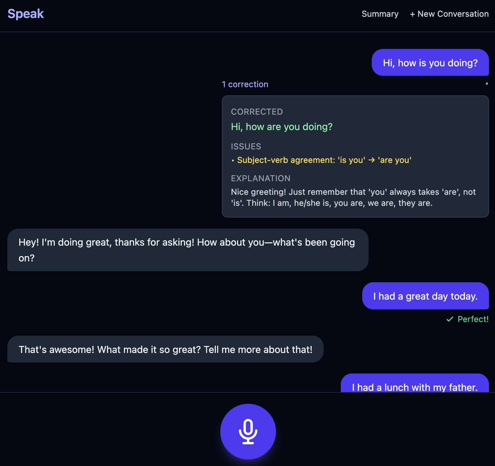
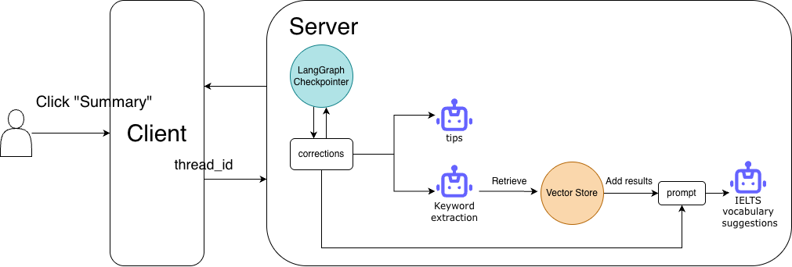

# Speak Web - AI English Conversation Partner

## Overview

This project is a web-based clone inspired by the Speak app, bringing the same immersive voice-based learning experience to the web while leveraging modern AI technologies and architectural patterns.

This is a full-stack English practice application that enables users to have voice-based conversations with an AI partner. The system integrates Claude LLM for natural dialogue generation, `OpenAI Whisper` for speech-to-text transcription, and `OpenAI TTS` for realistic voice responses.

## Key Highlights

**End-to-End Voice Conversation:** Users speak to practice English, with voice automatically transcribed via `OpenAI Whisper API`, and AI responses converted to natural-sounding speech via `OpenAI TTS API`, creating a fully voice-based immersive learning experience without typing.

**Real-time Grammar Correction:** A parallel analysis pipeline examines user messages for grammar errors and returns structured corrections without interrupting the conversation flow, processed simultaneously with the AI response.

**Guardrail for Content Filtering:** A guardrail system classifies user intent to ensure the conversation stays focused on English practice, rejecting off-topic or task-based requests.

**Conversation Summary & RAG Integration:** Post-conversation summaries include AI-generated learning tips and contextually relevant vocabulary suggestions using RAG (FAISS vector index with AWS Bedrock embeddings for semantic search).

## Technology Stack

- **Frontend:** React 19, TypeScript, Vite, Tailwind CSS 4
- **Backend:** Python 3.13, FastAPI, LangGraph, LangChain
- **AI Integration:** Claude LLM (Anthropic SDK), OpenAI Whisper API, OpenAI TTS API
- **RAG Infrastructure:** FAISS vector index, AWS Bedrock Embeddings, LangChain

## Features

### 1 - Chat

Voice-based English conversation with AI

- Speak to the AI partner and receive natural voice responses.
- Get real-time grammar corrections without interrupting the conversation flow.

https://github.com/user-attachments/assets/1e5d4ca3-bc77-47c1-a06f-f97bafc78da2

 

- Guardrail filters off-topic requests to keep the conversation focused on English practice.

https://github.com/user-attachments/assets/05daf82e-4802-4984-ad4c-b0a49ecadf8a

 

#### High level design

#### Technical Note - Parallel Execution with Immediate Emission

The LangGraph workflow is designed to minimize response latency through parallel execution. After the guardrail node classifies the user intent, the chat generation and grammar correction nodes run in parallel rather than sequentially. Additionally, results are emitted immediately as they become available via Server-Sent Events (SSE), allowing the frontend to start rendering and playing audio without waiting for the entire pipeline to complete.

 

### 2 - Conversation Summary

Based on grammar corrections in a single conversation

1. Generate personalized learning tips.
2. Generate IELTS vocabulary suggestions.

https://github.com/user-attachments/assets/79b5d34b-fd47-4a8f-bc44-f86d431b94bc

 

#### High level design

#### Technical Note - RAG Implementation Approach

The IELTS vocabulary recommendation system uses a structured JSON format `(/backend/data/IELTS.json)` where each word is treated as an individual chunk in the FAISS vector index. To improve search accuracy, we employ a two-step process: before querying the vector store, we first use an LLM to extract relevant keywords from the conversation context. This keyword extraction step significantly enhances the precision of semantic search results.

## Technical Decisions

### Model Selection Strategy

To optimize costs while maintaining quality, we use different Claude models for different task complexities:

- **Haiku**: Used for conversational `chat responses`, `keyword extraction`, and `intent classification (guardrail)`. Beyond cost savings, Haiku's faster inference significantly reduces Time To First Token (TTFT), improving overall system responsiveness for real-time interactions.
- **Sonnet**: Used for tasks requiring higher accuracy and structured output (`grammar corrections`, `conversation summaries with pattern analysis`)

### RAG Retrieve Strategy

In my initial approach, I used the full corrected sentences to query the `FAISS index` directly. However, I found that whole-sentence retrieval yielded poor precision, often returning irrelevant vocabulary. I then decided to add an intermediate keyword extraction agent to extract key terms from the corrected sentences before querying. This improved precision significantly, but the tradeoff was increased latency.
